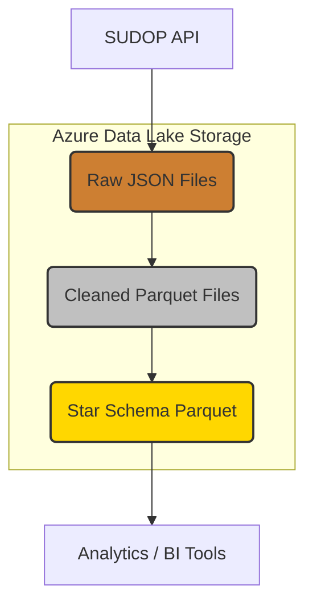

# ETL-Azure-Pipeline-SUDOP

This project implements a complete ETL (Extract, Transform, Load) pipeline using Python, Docker, and Microsoft Azure services. The pipeline follows a Medallion Architecture (Bronze -> Silver -> Gold) to progressively refine data from the Polish SUDOP API into a structured, analytics-ready format.

## Medallion Architecture Overview

The pipeline is structured into three distinct layers, each serving a specific purpose:



1.  **Bronze Layer (Raw Data):**
    *   **Purpose:** Ingests raw, unaltered data directly from the source. This ensures data lineage and allows for rebuilding subsequent layers without re-fetching from the source API.
    *   **Format:** JSON files (one per dictionary, one per case file download).
    *   **Location:** `bronze` container in Azure Data Lake.

2.  **Silver Layer (Curated Data):**
    *   **Purpose:** Cleans, validates, and structures the raw data. This layer represents a single source of truth for clean, queryable data.
    *   **Format:** Columnar Parquet files for efficiency.
    *   **Structure:**
        *   `przypadki_pomocy.parquet`: A single, consolidated table of all aid cases.
        *   `slownik_gmina_siedziby.parquet`, `slownik_forma_pomocy.parquet`, etc.: Separate tables for each dictionary.

3.  **Gold Layer (Analytical Data):**
    *   **Purpose:** Creates a highly refined, aggregated data model optimized for business intelligence and analytics.
    *   **Format:** Columnar Parquet files.
    *   **Structure:** A **Star Schema** with a central fact table and multiple dimension tables, perfect for BI tools like Power BI or Tableau.
        *   `fact_przypadki_pomocy`: Contains numeric measures and keys.
        *   `dim_beneficjent`, `dim_data`, `dim_geografia`, etc.: Descriptive dimension tables.

---

## Getting Started

### Prerequisites

*   An Azure subscription
*   An Azure Storage Account with Data Lake Storage Gen2 enabled (`bronze`, `silver`, `gold` containers).
*   Azure Databricks Workspace (Standard or Premium)
*   Azure Data Factory

### Environment Setup

1.  Clone the repository.
2.  Create a file named `.env` in the project root.
3.  Add your Azure Storage connection string and Databricks configuration:
    ```
    AZURE_STORAGE_CONNECTION_STRING="your_storage_account_connection_string"
    DBT_DATABRICKS_HOST="adb-xxxxxx.azuredatabricks.net"
    DBT_DATABRICKS_HTTP_PATH="sql/protocolv1/o/..."
    DATABRICKS_TOKEN="your-databricks-personal-access-token"
    ```
4. Set up a Databricks Repo inside your Databricks workspace targeting your GitHub fork of this repository.

---

## Running the ETL Pipeline

This project relies on Azure Data Factory to orchestrate Databricks Notebooks and dbt!

### 1. Configure the Orchestrator
Inside Azure Data Factory Studio, create a Linked Service to Azure Databricks (Compute tab) using your `DATABRICKS_TOKEN`. 

### 2. Set up the Pipeline
Create a new pipeline in Azure Data Factory with two **Notebook Activities**:

#### Activity 1: Bronze to Silver (Spark)
- **Path**: `/Workspace/Users/your.email@domain.com/etl_project/src/databricks/sudop_etl_bronze_to_silver`
- This step reads raw JSON from the `bronze` container, applies heavy data cleaning and structuring, and outputs idempotent Delta Parquet tables into the `silver` container.

#### Activity 2: Silver to Gold (dbt)
- **Path**: `/Workspace/Users/your.email@domain.com/etl_project/src/databricks/dbt_runner`
- This notebook implicitly executes `dbt run --profiles-dir .` against the `dbt_project/` folder in your Databricks repo, dynamically building the analytical Star Schema as Delta tables in the `gold` container!

### 3. Run It!
Click **Debug** or **Trigger Now** on the pipeline in Azure Data Factory to watch the highly scalable cluster process your data into ready-to-query models.

---

## Local Docker Legacy (Optional)

If you prefer testing heavily locally without Databricks, the codebase still contains the legacy Docker Compose approach.
```bash
docker compose --profile all up --build
```

---

## Infrastructure as Code (Terraform)

The Azure infrastructure for this project is fully defined and managed using Terraform. The configuration files are located in the `infra/` directory.

### Deployed Resources

The Terraform script provisions the following key Azure resources:

*   **Resource Group:** A logical container for all project resources (`rg-etl-project-dev`).
*   **Azure Data Lake Storage Gen2:** The core storage for all data layers, with `bronze`, `silver`, and `gold` containers.
*   **Azure Data Factory:** Visual orchestrator spanning Databricks workflows.
*   **Azure Databricks Workspace:** A scalable Spark compute engine dynamically provisioned for data modeling.
*   *Legacy:* Azure Container Registry, Apps, and Key Vault are additionally defined if you wish to run the older Python-only versions.

### How to Deploy the Infrastructure

#### Prerequisites

1.  [Install Terraform](https://learn.hashicorp.com/tutorials/terraform/install-cli).
2.  [Install Azure CLI](https://docs.microsoft.com/en-us/cli/azure/install-azure-cli) and authenticate with your Azure account:
    ```bash
    az login
    ```
3. Set your subscription
    ```bash
    az account set --subscription "My Subscription"
    ```

#### Deployment Steps

1.  **Navigate to the infra directory:**
    ```bash
    cd infra
    ```
2.  **Initialize Terraform:**
    This will download the necessary provider plugins.
    ```bash
    terraform init
    ```
3.  **Create a `terraform.tfvars` file:**
    Create this file in the `infra/` directory and add the required variable values. You can get these from your Azure subscription and Service Principal details:
    ```hcl
    subscription_id = "your-azure-subscription-id"
    client_id       = "your-service-principal-client-id"
    client_secret   = "your-service-principal-client-secret"
    tenant_id       = "your-azure-tenant-id"
    ```
4.  **Plan the deployment:**
    This will show you what resources Terraform will create.
    ```bash
    terraform plan
    ```
5.  **Apply the configuration:**
    This will create the resources in Azure.
    ```bash
    terraform apply
    ```

After applying, Terraform will output the names and details of the created resources.

---

## Project Documentation

For more detailed information, please refer to the documents in the `documentation/` directory:

*   **[Architecture Overview](./documentation/ARCHITECTURE.md):** A high-level diagram and description of the system components and data flow.
*   **[Data Quality Risks](./documentation/DATA_QUALITY_RISKS.md):** An analysis of potential data quality issues and the strategies used to mitigate them.

## Analytics

The final, analytics-ready tables are stored in the `gold` container. For sample queries that demonstrate how to join the fact and dimension tables to answer business questions, see the `analysis/` directory:

*   **[Sample Queries](./analysis/sample_queries.sql):** Example SQL queries for use in an analytics platform like Azure Synapse, Databricks, or DuckDB.

