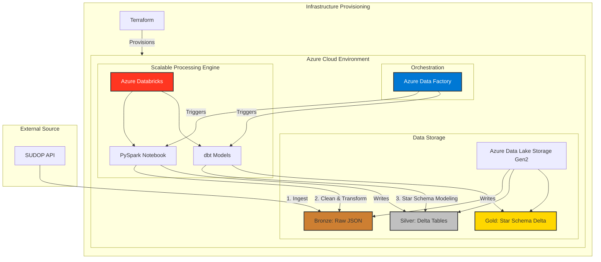

# High-Level Architecture

This document provides a high-level overview of the components and data flow in the SUDOP ETL pipeline.

## System Architecture Diagram

The architecture follows a classic ETL pattern orchestrated within a Docker environment and deployed on Azure infrastructure.

## Component Breakdown

1.  **Orchestration (Azure Data Factory):** The central orchestrator that triggers and monitors the end-to-end data pipeline, kicking off Databricks notebooks.
2.  **Azure Infrastructure (Managed by Terraform):**
    *   **Azure Data Lake Storage (ADLS) Gen2:** The core of our Medallion Architecture.
    *   **Azure Databricks:** Scalable Apache Spark environment for transformation.
3.  **ETL Scripts:**
    *   **Bronze Ingestion (Python Container):** Connects to the external SUDOP API, handles rate limiting, and lands raw JSON in the `bronze` container.
    *   **Silver Transformation (PySpark notebook):** Reads from the bronze layer, cleans data idempotently, and structures it into Delta tables in the `silver` container.
    *   **Gold Transformation (dbt on Databricks):** Declarative SQL models run via dbt to build the final star schema (fact and dim tables) as Delta tables in `gold`.

1.  The **Bronze** job runs, pulling data from the SUDOP API and storing it as raw JSON in ADLS.
2.  The **Silver** job runs, reading the raw JSON, cleaning it, and saving it as structured Parquet files.
3.  The **Gold** job runs, reading the clean Parquet files and building the final dimensional model for analytics.
