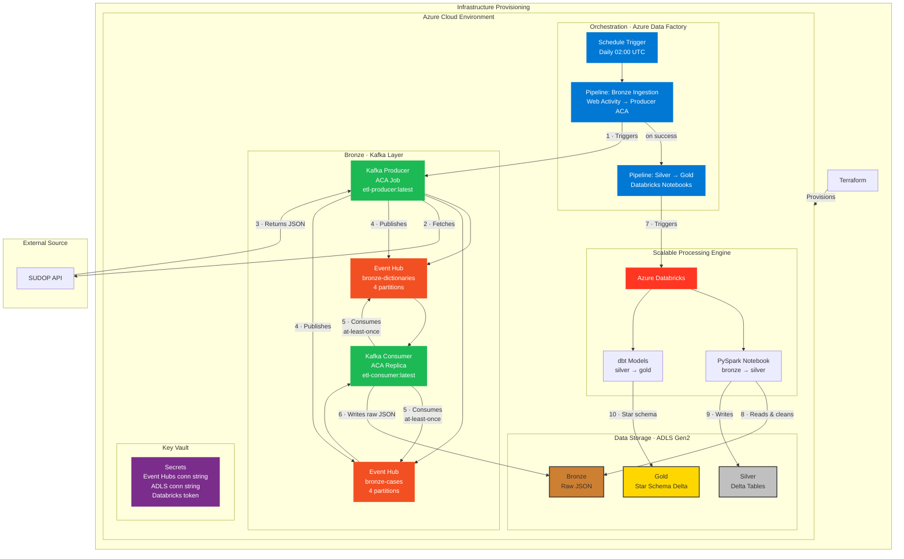

# High-Level Architecture

This document provides a high-level overview of the components and data flow in the SUDOP ETL pipeline.

## System Architecture Diagram

The architecture follows a **Kafka-backed Medallion pattern** orchestrated entirely within Azure.  
The Bronze layer uses a producer/consumer model over Azure Event Hubs (Kafka-compatible).  
The Silver and Gold layers continue to use Azure Databricks orchestrated by Azure Data Factory.



## Component Breakdown

### 1. Orchestration — Azure Data Factory

The sole orchestrator for the entire pipeline.

- **Schedule Trigger** fires daily at 02:00 UTC.
- **Bronze Ingestion Pipeline** — contains a single **Web Activity** that calls the Azure Container Apps Jobs API to start the Producer container on demand.
- **Silver → Gold Pipeline** — triggers on Bronze pipeline success; runs the existing Databricks notebooks (unchanged).

### 2. Message Bus — Azure Event Hubs (Kafka-compatible)

| Resource | Config |
|---|---|
| Namespace SKU | Standard (required for Kafka protocol) |
| Kafka bootstrap | `<namespace>.servicebus.windows.net:9093` |
| Topic: `bronze-dictionaries` | 4 partitions, 1-day retention |
| Topic: `bronze-cases` | 4 partitions, 1-day retention |
| Auth policy | `bronze-send-listen` — Send + Listen (stored in Key Vault) |

The `confluent-kafka` Python client connects using SASL/SSL with `$ConnectionString` as the username — the standard pattern for Event Hubs Kafka endpoints. No SDK changes are needed versus plain Kafka.

### 3. Kafka Producer — Azure Container App (Job mode)

- **Image:** `etl-producer:latest` (pushed to ACR)
- **Mode:** Job — starts on ADF trigger, runs, then exits.
- **Replicas:** 0 at rest, 1 when running (cost-optimised).
- **Responsibility:**
  1. Fetches all 5 SUDOP dictionaries from the API.
  2. Publishes each dictionary as a self-describing JSON message to `bronze-dictionaries`.
  3. Reads the municipality list, polls the SUDOP queue for each municipality, publishes results to `bronze-cases`.
  4. Calls `producer.flush()` before exit to guarantee all messages are delivered.

### 4. Kafka Consumer — Azure Container App (Replica mode)

- **Image:** `etl-consumer:latest` (pushed to ACR)
- **Mode:** Replica — always-on, at least 1 instance running.
- **Consumer group:** `bronze-consumer`
- **Responsibility:**
  1. Subscribes to both `bronze-dictionaries` and `bronze-cases`.
  2. Deserialises each message and resolves the ADLS write path from the message type/metadata.
  3. Writes the raw JSON payload to ADLS `bronze` container.
  4. Commits the Kafka offset **only after** a confirmed ADLS write (at-least-once delivery guarantee).
  5. Handles `SIGTERM` gracefully for clean ACA shutdown/restart.

### 5. Azure Infrastructure — Managed by Terraform

| Resource | Purpose |
|---|---|
| Resource Group | Logical container |
| ADLS Gen2 | Bronze / Silver / Gold storage (Medallion layers) |
| Event Hubs Namespace | Kafka-compatible message bus |
| ACR | Container registry for producer + consumer images |
| ACA Environment | Shared container app hosting environment |
| ADF | Pipeline orchestration |
| Databricks | Spark transform + dbt |
| Key Vault | Secrets (Event Hubs, ADLS, Databricks tokens) |

### 6. ETL Scripts — Medallion Layers

- **Bronze Ingestion (Kafka path):** `src/kafka/producer.py` fetches from SUDOP API → publishes to Event Hubs. `src/kafka/consumer.py` reads from Event Hubs → writes raw JSON to ADLS.
- **Bronze Ingestion (Standalone fallback):** `src/bronze/ingest_sudop.py main()` writes directly to ADLS when `KAFKA_ENABLED=false`.
- **Silver Transformation (PySpark):** Reads bronze JSON, cleans and structures data into Delta tables in `silver`.
- **Gold Transformation (dbt):** Declarative SQL models build the final Star Schema in `gold`.

## Data Flow (Numbered Steps)

1. ADF Schedule Trigger fires.
2. ADF Bronze Pipeline starts a **Web Activity** → Producer ACA Job starts.
3. Producer fetches 5 dictionaries from SUDOP API.
4. Producer publishes dictionary messages to `bronze-dictionaries` Event Hub.
5. Producer fetches cases per municipality (polling SUDOP queue).
6. Producer publishes case messages to `bronze-cases` Event Hub.
7. Producer flushes and exits — ACA Job completes.
8. Consumer (always running) picks up messages → writes JSON to ADLS `bronze/`.
9. ADF Silver→Gold Pipeline starts (on Bronze success) → Databricks runs.
10. PySpark reads bronze JSON → cleans → writes Silver Delta tables.
11. dbt builds Gold Star Schema from Silver.

## Local Development

For local testing without real Azure Event Hubs, use `docker-compose.yml`:

```bash
# Start local Kafka + consumer
docker-compose up -d

# Trigger the producer once
docker-compose --profile producer run --rm producer

# Watch consumer output
docker-compose logs -f consumer

# Stop everything
docker-compose down
```

Set `KAFKA_USE_EVENT_HUBS=false` in `.env` to switch to the local Kafka broker automatically.
