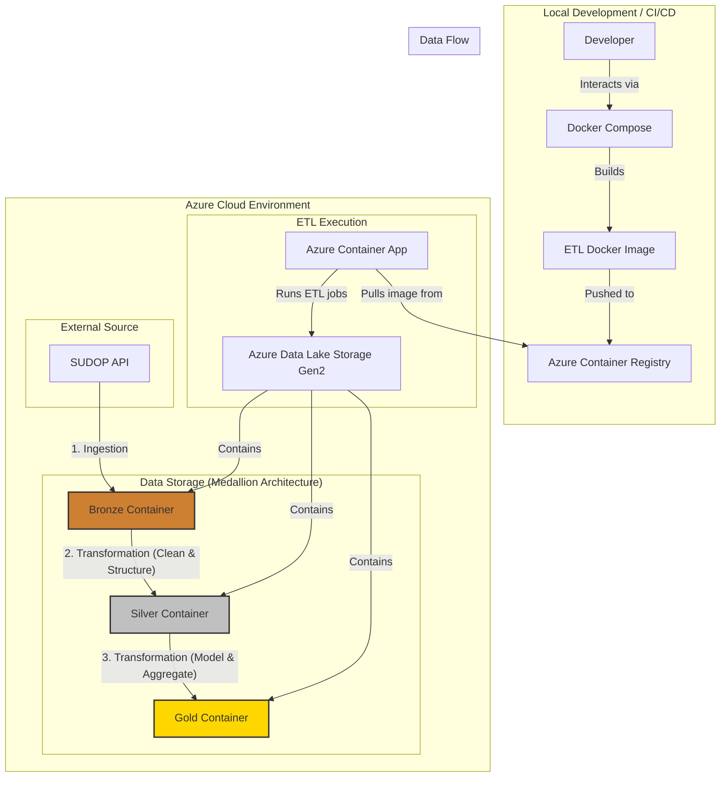

# High-Level Architecture

This document provides a high-level overview of the components and data flow in the SUDOP ETL pipeline.

## System Architecture Diagram

The architecture follows a classic ETL pattern orchestrated within a Docker environment and deployed on Azure infrastructure.

## Component Breakdown

1.  **Docker Environment:**
    *   **Docker Compose:** The primary tool for local development and orchestration. It defines three separate services (`bronze-ingest`, `curated-transform`, `gold-transform`) that can be run independently or together.
    *   **Dockerfile:** Defines the environment for the ETL application, installing Python, Azure CLI, Terraform, and all necessary Python libraries.

2.  **Azure Infrastructure (Managed by Terraform):**
    *   **Azure Data Lake Storage (ADLS) Gen2:** The core of our data platform, separated into three containers (`bronze`, `silver`, `gold`) that correspond to the layers of the Medallion Architecture.
    *   **Azure Container Registry (ACR):** A private Docker registry used to store the ETL application image, making it ready for cloud execution.
    *   **Azure Container App (ACA):** A serverless container runtime that executes our ETL jobs. It pulls the image from ACR and is configured with the necessary environment variables (like the storage connection string) to run.

3.  **ETL Scripts (Python):**
    *   **Bronze (`ingest_sudop.py`):** Connects to the external SUDOP API, handles rate limiting and retries, and lands the raw JSON data in the `bronze` container.
    *   **Silver (`build_curated_sudop.py`):** Reads from the bronze layer, cleans the data, casts data types, and structures it into separate, queryable Parquet tables in the `silver` container based on the `metadata.json` contract.
    *   **Gold (`build_gold_layer.py`):** Reads from the silver layer and builds a final, analytics-ready star schema, writing the `fact` and `dim` tables as Parquet files to the `gold` container.

## Data Flow Summary

1.  The **Bronze** job runs, pulling data from the SUDOP API and storing it as raw JSON in ADLS.
2.  The **Silver** job runs, reading the raw JSON, cleaning it, and saving it as structured Parquet files.
3.  The **Gold** job runs, reading the clean Parquet files and building the final dimensional model for analytics.
